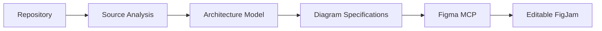

# diagram-codebase

A [Claude Code](https://docs.claude.com/en/docs/claude-code) skill that reverse-engineers
a real repository into an **evidence-backed architecture model** and publishes it as
**editable FigJam diagrams** through the official Figma MCP server.

It is built for understanding systems you did not write (or no longer remember):
how execution actually flows, where data goes and how it changes shape, what the
core algorithms do, and what is deployed where. Every box and arrow in the model
points back to a file and line range. The goal is a diagram you can check against the
code, not a pretty picture that only looks plausible.

```
/diagram-codebase --depth deep
```

## Contents

- [Features](#features)
- [How it works](#how-it-works)
- [Prerequisites](#prerequisites)
- [Installation](#installation)
- [Figma MCP configuration](#figma-mcp-configuration)
- [Usage](#usage)
- [Outputs](#outputs)
- [Supported architectures](#supported-architectures)
- [Diagram types](#diagram-types)
- [Rate limits](#rate-limits)
- [Privacy and security](#privacy-and-security)
- [Limitations](#limitations)
- [Troubleshooting](#troubleshooting)
- [Example output](#example-output)
- [Live verification status](#live-verification-status)
- [Development](#development)
- [License](#license)

## Features

- **Evidence on everything.** Each node and edge in `model.json` cites evidence
  (file, line range, symbol). Evidence keeps its status (`confirmed`,
  `static_inferred`, `documented_only`, ...) instead of being flattened into "true".
- **Deterministic scanning plus Claude analysis.** Structural facts come from
  standard-library Python analyzers; meaning (execution traces, data flow, algorithm
  stages, subsystem naming) comes from Claude, and every Claude claim is checked
  against the cited source before it enters the model.
- **Eleven diagram types**, chosen automatically from what the model can support:
  system overview, subsystems, data flow, execution, sequence, algorithm, state,
  dependency, infrastructure, ROS 2 graph / TF tree, and ERD.
- **Readable by construction.** Node and edge limits per diagram; oversized diagrams
  are split, and anything left out is listed in the diagram's notes rather than
  dropped silently.
- **Editable FigJam output.** Diagrams are created with Figma's `generate_diagram`
  tool, arranged as sections on one board, with a color legend and a diagram index.
- **Review before publish.** You see exactly which labels will leave your machine and
  confirm once before anything is sent to Figma.
- **Rate-limit aware.** A local budget, rolling windows and Claude Code hooks keep the
  skill under Figma's documented MCP limits; a budget stop is resumable.
- **Resumable and incremental.** `--resume` continues an interrupted run;
  `--update` re-analyzes only what changed since the last run and regenerates only the
  affected diagrams.
- **Dry run.** `--dry-run` produces the model, plan and Mermaid locally with zero Figma
  calls.

## How it works



The work is split deliberately between Claude and deterministic utilities
(`scripts/dc.py`, standard-library Python):

| Stage | Who | What happens |
|---|---|---|
| Scan | deterministic | Inventory of files and languages, manifests, git revision; AST/regex analyzers emit modules, classes, functions, endpoints, channels, datastores, ROS 2 interfaces and deployments with evidence. |
| Analysis | **Claude** | Reads code to trace execution, data flow, algorithms and state machines and to name subsystems. Writes findings JSON with cited evidence. Large repos fan out to read-only subagents. |
| Evidence check | deterministic | Every Claude claim must cite a file in the inventory, valid lines, and a symbol that appears there; anything without accepted evidence is rejected and listed in `validation.json`. |
| Merge | deterministic | Findings and scan results merge into `model.json`; evidence status and confidence are derived, never asserted. |
| Plan | deterministic | Chooses diagram types, levels of detail and splits; generates Mermaid; lints it against Figma's importer rules; sanitizes labels; writes `publish/review.md`. |
| Publish | deterministic driver, Claude executes | `dc.py next` emits one exact Figma tool call at a time; Claude makes the call and records the result. Claude never decides what is sent. |
| Summary | both | `REPORT.md` with coverage (with denominators), verification status and uncertainties. |

Contracts between these stages are in [docs/DESIGN.md](docs/DESIGN.md); a
contributor-oriented module map is in [docs/ARCHITECTURE.md](docs/ARCHITECTURE.md).

## Prerequisites

- **Claude Code** (a version with skills and skill-scoped hooks).
- **Python 3.10 or newer** as `python3` on `PATH`. No third-party packages are needed
  at runtime.
- **git** (used read-only to record the analyzed revision and to diff for `--update`).
- **Figma**: the official Figma MCP server, preferably via the official Figma plugin for
  Claude Code (it also provides the `figma:*` skills the publish loop loads), and a
  Figma account whose seat can write to FigJam files, in practice a **Full seat** on a
  paid plan. Starter plans and View/Collab seats get only a handful of MCP calls per
  month according to Figma's plugin documentation, which is not enough for a run.
- **Optional: Node.js 20+** to run the real Mermaid parser as an extra check on
  generated diagrams (`tools/mermaid-check`). Without it the check is reported as
  "unavailable", never as passed.

Not needed for `--dry-run`: any Figma account or MCP server.

## Installation

The skill lives in `skills/diagram-codebase/`. Pick one of the following.

### Personal skill (all your projects)

```sh
git clone <this-repo-url> diagram-codebase
mkdir -p ~/.claude/skills
ln -s "$(pwd)/diagram-codebase/skills/diagram-codebase" ~/.claude/skills/diagram-codebase
# or copy instead of symlinking:
# cp -r diagram-codebase/skills/diagram-codebase ~/.claude/skills/
```

### Project-local skill (one repository, shared with your team)

```sh
mkdir -p .claude/skills
cp -r /path/to/diagram-codebase/skills/diagram-codebase .claude/skills/
```

Add `.diagram-codebase/` to that project's `.gitignore` if you want it listed there
too (the skill already writes a `.gitignore` containing `*` inside its output
directory, so outputs are never committed by accident).

### As a Claude Code plugin

The repository root is laid out as a plugin: `.claude-plugin/plugin.json` plus
`skills/`. You can install it from its Git URL through a plugin marketplace using
Claude Code's `/plugin` command. The exact marketplace steps (adding a marketplace,
naming, updating) depend on your Claude Code version: see the Claude Code plugin
documentation. When installed as a plugin, the skill may be namespaced under the
plugin name.

Start a new Claude Code session after installing so the skill (and its hooks) are
picked up. Optionally, for the Mermaid parser check:

```sh
cd skills/diagram-codebase/tools/mermaid-check && npm ci
```

## Figma MCP configuration

1. **Recommended:** install the official Figma plugin for Claude Code, which configures
   the Figma MCP server and installs Figma's agent skills (including
   `figma-generate-diagram`, which defines the Mermaid rules this skill follows).
   Follow Figma's instructions; at the time of writing they document:

   ```sh
   claude plugin install figma@claude-plugins-official
   ```

2. **Alternative:** add Figma's remote MCP server directly, per Figma's documentation:

   ```sh
   claude mcp add --transport http figma https://mcp.figma.com/mcp
   ```

   Without the plugin, the `figma:*` skills that the publish loop asks Claude to load
   are not installed locally (Figma's server advertises fallback copies as MCP
   resources); the plugin route is the one this skill is written against.

3. **Authenticate:** run `/mcp` in Claude Code, select the Figma server and complete
   the OAuth flow in your browser.

The skill's rate-limit hooks match MCP tools named `mcp__.*figma.*`. If you register
the server under a name that does not contain `figma`, the hooks will not fire (the
driver's own budget check still applies).

## Usage

The skill is invoked manually (it is not auto-triggered by the model):

```
/diagram-codebase [options] [free-text hint]
```

| Option | Meaning |
|---|---|
| `--depth overview\|standard\|deep` | How much to analyze and draw. Diagram caps: overview 2, standard 10 (default), deep 25. Deep also enables parallel analysis subagents. |
| `--focus <subsystem>` | Concentrate on one subsystem (matched against subsystem id, name and paths, then node names); keeps one hop of context. |
| `--type <t>[,<t>...]` | Only these diagram types: `master, subsystem, dataflow, execution, sequence, algorithm, dependency, infrastructure, ros2, erd, state`. Aliases such as `arch`, `data`, `flow`, `seq`, `algo`, `deps`, `infra`, `ros`, `er`, `states` are accepted. |
| `--dry-run` | Analyze and write the model, plan and Mermaid locally. No Figma calls. |
| `--resume` | Continue an interrupted or budget-paused run from its last completed phase. |
| `--update` | Re-analyze what changed since the last run and regenerate only affected diagrams. Cannot be combined with `--resume`. |
| `--yes`, `-y` | Skip the single confirmation before publishing. |
| `--verify-visual` | Also take screenshots during verification (costs extra Figma calls). |
| `--out <dir>` | Output directory (default `<repo>/.diagram-codebase`). |
| `--help`, `-h` | Print usage. |

Any text that is not an option is passed to Claude as a focus question for the analysis.

Examples:

```
/diagram-codebase
/diagram-codebase --dry-run
/diagram-codebase --depth deep
/diagram-codebase --depth overview --yes
/diagram-codebase --focus localization --type dataflow,algorithm
/diagram-codebase --type erd,sequence how does checkout reach the payment provider?
/diagram-codebase --resume
/diagram-codebase --update
```

A run reports progress at each phase: parse arguments, init, scan, analysis, merge,
plan and review, confirm, publish, summary. Before publishing it shows the planned
diagrams, the question each one answers, and an estimate of Figma calls, and asks
once for approval (unless `--yes`).

The deterministic CLI can also be run directly, e.g. for CI or inspection:

```sh
python3 skills/diagram-codebase/scripts/dc.py run --dry-run --repo path/to/repo --out /tmp/dc-out
python3 skills/diagram-codebase/scripts/dc.py status --repo path/to/repo
python3 skills/diagram-codebase/scripts/dc.py budget
```

Note that `run --dry-run` without Claude contains only what the deterministic scanners
found; the Claude analysis phase is what adds execution traces, data flows and
algorithms.

## Outputs

**In Figma:** one FigJam file per run (reused by `--resume` and `--update`), with one
section per diagram arranged in rows (overview, subsystems, flows,
algorithms/state, structure), plus a **Legend** (category colors) and an **Index** of
diagrams. Diagrams are native FigJam shapes and connectors, so you can edit them.
Each section is tagged with plugin data (`diagram_id`, `run_id`, `content_hash`) so
later runs can find and replace it.

**On disk** (`<repo>/.diagram-codebase/` by default; ignored by git via its own
`.gitignore`):

| Path | Contents |
|---|---|
| `config.json` | Your overrides (budget, scan excludes, plan limits) |
| `inventory.json` | Files, languages, manifests, git revision, skipped/excluded counts |
| `findings/scan.json` | Deterministic scanner findings |
| `findings/<area>.json` | Claude's findings per analysis area |
| `model.json` | Merged, validated architecture model |
| `validation.json` | Errors, warnings, rejected claims, stats |
| `plan.json` | Diagram plan, skipped types with reasons, coverage |
| `mermaid/<id>.mmd` | The exact Mermaid text sent to Figma |
| `publish/review.md` | Everything that will leave the machine |
| `publish/results/` | Raw Figma tool results |
| `manifest.json` | Run state: phases, per-diagram status, Figma ids, pending action |
| `REPORT.md` | Final summary |

The rate-limit ledger is global, because Figma's quota is per account:
`${XDG_CACHE_HOME:-~/.cache}/diagram-codebase/ledger.jsonl`.

## Supported architectures

**Deterministic analyzers** (no external tools, no code execution):

| Area | Coverage |
|---|---|
| Python | Full AST: modules, classes, functions, imports, resolvable calls |
| JavaScript / TypeScript | Regex-based: modules, imports, exported functions/components, routes, fetch/axios requests, messaging |
| C / C++ | Regex-based: includes, classes/structs, functions, `main`, name-based call sites |
| ROS 2 | rclpy and rclcpp nodes, publishers/subscribers, services, actions, parameters, TF; Python and XML launch files, setup.py console scripts, CMake executables |
| Web frameworks | FastAPI, Flask, Django (URL configs), Express, Next.js file routes; client requests matched to endpoints across languages |
| Data | SQLAlchemy, Django ORM, SQL; database clients (SQLite, Postgres, MongoDB, Redis, ...) |
| Messaging / concurrency | Celery tasks, publish/subscribe and event-emitter calls, asyncio and `queue.Queue` producers/consumers, thread/task spawns |
| Deployment | docker-compose services, Dockerfiles, Kubernetes manifests |

**Everything else** (Java/Spring, Go, Rust, ML training pipelines, other frameworks)
is analyzed by Claude, guided by the framework notes in
[`skills/diagram-codebase/references/frameworks/`](skills/diagram-codebase/references/frameworks/).
Those findings go through the same evidence check, but there is no deterministic
skeleton underneath them, so coverage depends on the analysis.

## Diagram types

The planner produces a type only when the model has content for it; otherwise it is
listed in `plan.json` under `skipped` with the reason.

| Type | Answers | Produced when |
|---|---|---|
| `master` | What are the major parts and how do they connect? | Always (at least 2 connected units) |
| `subsystem` | What is inside one subsystem and what does it talk to? | Subsystems with enough significant nodes (up to 5 at standard, 12 at deep) |
| `dataflow` | How does data move and change representation? | Claude data flows, or derived from data-moving edges |
| `execution` | What runs, in what order, with which branches? | Claude execution flows, or traced from entry points |
| `sequence` | Who talks to whom over time for one scenario? | Claude request flows, or web request chains |
| `algorithm` | What are the stages and decisions of a core computation? | Claude algorithm findings with at least 2 stages |
| `state` | What states does an entity or process move through? | Claude state machines |
| `dependency` | What depends on what? | An import graph with at least 3 units |
| `infrastructure` | What is deployed where, with what config? | At least 2 deployment units |
| `ros2` | Which ROS 2 nodes exchange which topics/services/actions; the TF tree | ROS 2 nodes with connections; 2 or more TF frames |
| `erd` | What are the entities and relations? | At least 2 entities |

Details and heuristics: [references/diagram-types.md](skills/diagram-codebase/references/diagram-types.md)
and [docs/PLANNER.md](docs/PLANNER.md).

## Rate limits

**Figma's documented limits** (check Figma's current MCP documentation for your plan):
Professional plans with a Dev or Full seat, and Education plans, are documented at
**200 calls per day and 10 per minute**. Other plans and seats differ. Limits are per
account. Documented as exempt: `whoami`, `create_new_file`, `add_code_connect_map` and
the authentication tools. Figma's plugin documentation also states that some
write tools are exempt; because which ones is not spelled out for `generate_diagram`
and `use_figma`, this skill counts them.

**What this skill enforces** (defaults, deliberately below the documented numbers):

| Setting | Default |
|---|---|
| `per_minute` | 8 counted calls in any rolling 60 s |
| `per_day` | 160 counted calls in any rolling 24 h |
| `max_hook_sleep_seconds` | 65 (longest wait for the minute window before denying) |
| `backoff_base_seconds` / `backoff_max_seconds` | 30 / 900 after Figma reports a rate limit |

Override per repository in `.diagram-codebase/config.json`:

```json
{"budget": {"per_minute": 4, "per_day": 40}}
```

How it is enforced:

- A **local ledger** records every counted call this skill makes. It is an
  **estimate** of your usage: calls from other sessions, other tools or the Figma UI
  are invisible to it, so Figma may limit you earlier than the ledger predicts.
  `dc.py budget` shows the estimate; it is never Figma's actual quota.
- **Hooks** (declared in the skill's frontmatter) run before and after every Figma MCP
  tool call while a run is active: they wait out a full minute window, deny calls
  past the daily budget, and start a backoff when Figma reports a rate limit.
  Limitation: hooks register when the skill is invoked and only match tools named
  `mcp__.*figma.*`; if they do not fire (see [Troubleshooting](#troubleshooting)),
  the driver's own check below still applies.
- The **driver** checks the same ledger before emitting each counted call and stops
  instead of exceeding the budget.
- On a **budget stop** the run reports which diagrams are done and which remain;
  `/diagram-codebase --resume` continues once the window clears.

## Privacy and security

- **Only diagram content leaves your machine.** What is sent to Figma is the Mermaid
  text in `mermaid/*.mmd` (titles, node and edge labels) plus small layout scripts.
  Source code, file contents and evidence snippets are not sent to Figma. (Claude
  itself reads your code as part of the analysis, as with any Claude Code session.)
- **Sanitizer.** Every label passes through a redactor that removes credentials
  (cloud keys, tokens, private keys, `password = ...` values, URL userinfo,
  high-entropy strings), e-mail addresses, home-directory paths and private IPv4
  addresses. It is pattern-based and can miss things.
- **Review before publish.** `publish/review.md` lists everything that will be sent and
  what was redacted (by category, never the values). You approve once before the first
  Figma call; use `--dry-run` to inspect without publishing.
- **Nothing is executed.** The analyzed repository's code, build scripts and tests are
  never run. Only read-only `git` commands are used.
- **The analyzed repository is not modified.** All outputs go to the output directory,
  which carries its own `.gitignore`, and to the cache directory.

Report security issues as described in [SECURITY.md](SECURITY.md).

## Limitations

- **Static analysis is best-effort.** Dynamic dispatch, reflection, dependency
  injection, plugin loading, metaprogramming and generated code are not resolved by the
  scanners. Claude may trace some of them; what it cannot trace is listed as an
  uncertainty.
- **JavaScript/TypeScript and C/C++ analyzers are regex-based**, not parsers. JS: no
  nested functions or class methods. C/C++: overloads, templates and macros defeat
  name resolution, so call edges are `static_inferred`, never `confirmed`.
- **Python analysis** does not follow return values or `Optional`/union types.
- **ROS 2:** launch-file namespaces are applied to remappings only; `parameters=` and
  `<include>` are not followed; TF lookups are recorded as "looked up" edges.
- **Claude findings are interpretive.** The evidence check confirms that the cited code
  exists and mentions the cited symbol; it cannot prove that Claude's interpretation of
  it is right. Evidence status is kept so you can tell scanned facts from inferences.
- **Figma's `generate_diagram`** supports flowcharts, sequence, state and ER diagrams
  only: no class diagrams, mindmaps, C4 and so on, and no control over node
  positions. Layout is done by Figma (ELK); this skill does not tune it.
- **Long labels** are capped at 80 characters by the Mermaid builder.
- **`--update` is file-diff based:** it maps changed files to affected nodes and
  diagrams. Changes with non-local effects may need a full run.
- **Unverified behavior is labeled as such** in the references and reports, e.g.
  whether Claude Code expands `${CLAUDE_SKILL_DIR}` inside skill hook commands (a
  fallback copy of the hook in the cache directory covers that case).

## Troubleshooting

| Symptom | What to do |
|---|---|
| Figma tools missing or "authentication required" | Run `/mcp`, select the Figma server, authenticate, then `/diagram-codebase --resume`. |
| Run stops with a budget or backoff reason | `dc.py budget` shows local estimates. Wait (about a minute for the minute window, up to 24 h for the day window), then `--resume`. Lower the budget in `config.json` if Figma limits you earlier. |
| `budget` shows no hook entries | Hooks did not fire: restart the session after installing, check the server name contains `figma`, check `python3` is on `PATH`. |
| `plan` reports Mermaid lint errors | Inspect `mermaid/<id>.mmd`; fix the cause (odd label, oversized diagram) and re-run. Do not hand-edit Mermaid sent to Figma. |
| Duplicate FigJam files or sections | Usually from Figma calls made outside the loop. Delete the extras; `manifest.json` names the file the run uses. |
| Session crashed mid-publish | `/diagram-codebase --resume`. An in-flight call is reconciled against the board before any retry. |

More: [references/troubleshooting.md](skills/diagram-codebase/references/troubleshooting.md).

## Example output

See [`examples/`](examples/) for dry-run output (model, plan and Mermaid) produced from
the test fixtures.

<!-- TODO(integrator): describe the examples and link a screenshot or board, if any. -->

## Live verification status

**TBD.** The publish loop is tested against a mocked Figma driver only. End-to-end
runs against a live Figma account have not yet been recorded here; until they are, treat
Figma-side behavior (layout, verification, rate-limit interaction) as unverified.

## Development

```sh
python3 -m pytest -q
uvx ruff check . && uvx ruff format --check .
python3 skills/diagram-codebase/scripts/dc.py run --dry-run --repo tests/fixtures/a_python_app --out /tmp/dc-out
```

Tests never call Figma. See [CONTRIBUTING.md](CONTRIBUTING.md) for setup, an
architecture tour and how to add analyzers and diagram types.

## License

[MIT](LICENSE). Copyright diagram-codebase contributors.
