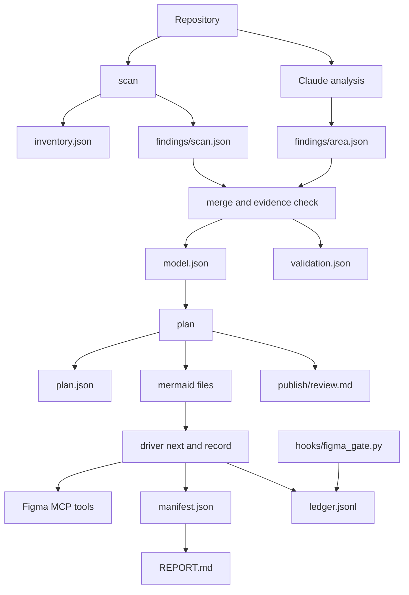

# Architecture (contributor tour)

A short map of the code. Data contracts (model, findings, plan, driver actions,
ledger, CLI) are defined in [DESIGN.md](DESIGN.md); planner heuristics are in
[PLANNER.md](PLANNER.md). If this file and DESIGN.md disagree, DESIGN.md wins.

## Two halves

| Half | Lives in | Responsible for |
|---|---|---|
| Claude (interpretive) | `skills/diagram-codebase/SKILL.md`, `references/` | Orchestrating phases, tracing execution and data flow, extracting algorithms and state machines, naming subsystems, writing `findings/<area>.json`, executing the Figma tool calls the driver emits |
| `dc.py` (deterministic) | `skills/diagram-codebase/scripts/` | Inventory, structural scanning, evidence checking, merge and validation, planning, Mermaid generation and linting, sanitizing, rate-limit budgeting, run state |

Claude never decides what is sent to Figma, and Python never guesses meaning.

## Data flow

## Module map (`skills/diagram-codebase/scripts/diagram_codebase/`)

| Module | Role |
|---|---|
| `common.py` | Atomic JSON/text writes, `DCError`, slugs, time helpers |
| `config.py` | `DEFAULTS` and deep-merge with `<out>/config.json` |
| `args.py` | Parses the raw `/diagram-codebase` argument string |
| `scan/inventory.py` | File walk, language detection, excludes, size limits |
| `scan/gitinfo.py` | Read-only git revision and dirty state |
| `scan/manifests.py` | Package manifests, framework detection, compose/Dockerfile/k8s deployments |
| `scan/lang_python.py` | Python AST index: modules, classes, functions, imports, call records |
| `scan/patterns_py.py` | Python pattern matchers: routes, pub/sub, datastores, HTTP clients, env reads, queues, ORM |
| `scan/lang_js.py` | Regex JS/TS analysis: imports, functions, Express/Next.js routes, requests, messaging |
| `scan/lang_cpp.py`, `scan/cpp_text.py` | Regex C/C++ analysis and comment/string-aware text helpers |
| `scan/ros2.py` | ROS 2 graph from rclpy, rclcpp, launch files, setup.py, CMake |
| `scan/__init__.py` | `run_scan`: runs analyzers, deployments, entry points, subsystem assignment |
| `model/schema.py` | Vocabularies, validator, derived evidence status and confidence |
| `model/builder.py` | `ModelBuilder`: the only way analyzers add nodes, edges and evidence |
| `model/merge.py` | Merges findings, `EvidenceChecker`, writes `model.json` and `validation.json` |
| `plan/view.py` | `ModelView`: indexes, unit mapping per level, edge aggregation |
| `plan/graph.py` | SCC, label propagation, components, packing, Jaccard |
| `plan/archmode.py` | Eligibility for Mermaid architecture-style layout |
| `plan/planner.py` | `plan_diagrams`: chooses, fits and splits diagrams |
| `mermaid/build.py` | DiagramSpec to Mermaid text |
| `mermaid/lint.py` | Figma importer rules |
| `mermaid/parsecheck.py` | Optional real-parser check via `tools/mermaid-check` (Node) |
| `sanitize.py` | Secret/PII redaction and label normalization |
| `figma/ledger.py`, `figma/ratelimit.py` | Global call ledger and rolling-window budget |
| `figma/driver.py` | `next`/`record` state machine: generate, place, legend, verify, reconcile |
| `figma/scripts.py` | `use_figma` JavaScript templates (sections, legend, index) |
| `state/manifest.py` | Run manifest: phases, diagrams, pending action, events |
| `state/update.py` | `--update`: changed files to affected nodes, diagrams and areas |
| `cli.py`, `../dc.py` | Command-line entry points (see DESIGN.md CLI table) |

Outside `scripts/`:

- `hooks/figma_gate.py`: standalone (does not import the package) PreToolUse /
  PostToolUse / PostToolUseFailure hook that gates Figma MCP calls using the same
  ledger format.
- `tools/mermaid-check/`: optional Node validator used by CI and `parsecheck.py`.
- `references/`: documents SKILL.md loads on demand (analysis guide, findings format,
  framework notes, Figma workflow, rate limits, troubleshooting).

## Tests

- `tests/unit/test_<module>.py`: one file per module, pure functions.
- `tests/integration/`: fixture repos in `tests/fixtures/` run through scan, merge,
  plan and Mermaid; the Figma driver loop runs against a mock.
- No test needs network, Figma, ROS or Node; Node-based parser tests are skipped when
  `tools/mermaid-check` is not installed.
